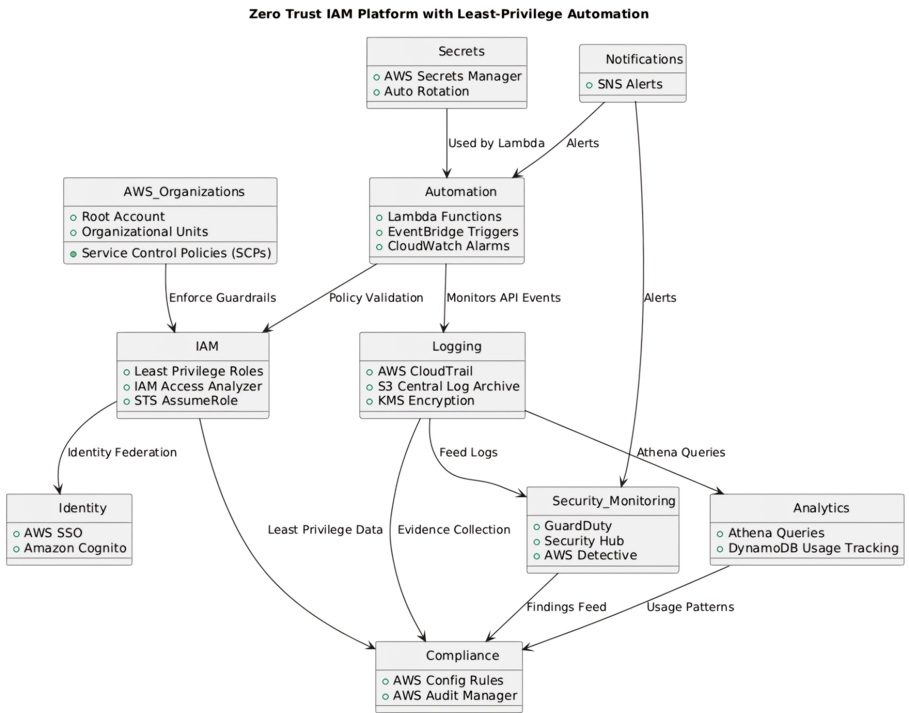

# AWS Zero Trust IAM Platform with Least-Privilege Automation

## 📌 Project Overview
This project implements a **Zero Trust Identity & Access Management (IAM) Platform** on AWS, designed to:
- Enforce least-privilege access across AWS accounts
- Automate IAM policy compliance checks and remediation
- Provide end-to-end monitoring, alerting, and logging
- Reduce security risks in cloud environments

---

## 🛠 Key Features
- **Role-Based Access Control (RBAC)** with Organizational Unit-level Service Control Policies (SCPs)
- **Real-time IAM compliance checks** using AWS Config & Access Analyzer
- **Automated detection & remediation** of risky IAM policies with Amazon EventBridge + AWS Lambda
- **Centralized monitoring & logging** using AWS CloudTrail, Amazon GuardDuty, and DynamoDB
- **Instant alerts** with Amazon CloudWatch Alarms + SNS notifications

---

## 📊 Project Outcomes
✅ 40–60% reduction in over-privileged IAM roles  
✅ IAM misconfigurations flagged within **2 minutes**  
✅ 100% IAM usage logs monitored across accounts  
✅ Zero Trust session enforcement reduced risk by ~50%  

---

---

## 🖼 Architecture Diagram

---

## 📄 Documentation
📘 [Step-by-Step Project Guide (PDF)](AWS_ZeroTrust_IAM_Platform/docs/Project_Steps.pdf)

---

## 🎤 Presentation
- 📄 [Project Presentation – PDF](AWS_ZeroTrust_IAM_Platform/presentation/Project_Presentation.pdf)  
- 📊 [Project Presentation – PPTX](AWS_ZeroTrust_IAM_Platform/presentation/Project_Presentation.pptx)

---

## 🚀 Tech Stack
- **AWS IAM**
- **AWS SSO**
- **Amazon Cognito**
- **AWS CloudTrail**
- **Amazon GuardDuty**
- **AWS Lambda**
- **Amazon DynamoDB**
- **Amazon EventBridge**
- **AWS Config**
- **Amazon CloudWatch**
- **Amazon SNS**

---

## 👥 Team
This project was successfully completed as a collaborative team effort, ensuring seamless integration of security automation across AWS services.

---

## 🔗 Connect
If you’d like to learn more about the implementation or collaborate on similar AWS security automation projects, feel free to connect with me here on [LinkedIn – Hasir Sayyed](https://www.linkedin.com/in/hasir-sayyed-b16520245) or check out my GitHub profile.
